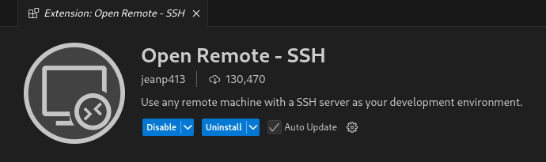

# filter_dns
Fluent-bit C Plugin : reverse DNS lookup of IP v4 addresses

references :
- https://howtos.davidsebek.com/vscodium-containers.html
- https://blog.ukjae.io/posts/implement-custom-plugin-to-fluent-bit/

## Fluent Bit Filter Plugin: DNS Lookup avec TTL
```
[FILTER]
    Name        dnslookup
    Match       *
    cache_ttl   300
```

Ajout du plugin à Fluent-bit :
```
FLB_PLUGIN(filter_dnslookup "DNS Lookup Filter" filter_dnslookup.c)
```

## Construire l'environnement de développement sur son poste de travail

Aller dans le répertoire devcontainer

recopier une clef publique SSH (exemple : cp ~/.ssh/id_rsa_dev.pub authorized_keys)

créer un fichier d'environnement (recopier env.default en .env) :
```
LINUX_USER_NAME=david
GIT_USER_NAME="ledav perso"
GIT_USER_EMAIL=dcaudre@gmail.com
```

variable | définition
----- | -----
LINUX_USER_NAME | compte utilisateur qui sera créé dans le conteneur
GIT_USER_NAME | GIT global user.name 
GIT_USER_EMAIL | GIT global user.email


l'image créée par défaut un compte LINUX_USER_NAME

créez l'image (elle inclut la compilation de Fluent-bit...) 
```
$ docker compose up --build -d
```
Un conteneur est maintenant disponible pour développer sur un environnement FLuent-bit complet

Si vous utilisez Codium, vous pouvez utiliser le plugin open remote ssh avec le paramétrage suivant :



créez le fichier ~/.ssh/config
```
Host fluentbit-container
    HostName 127.0.0.1
    User david
    Port 2022
```

vous êtes parés !